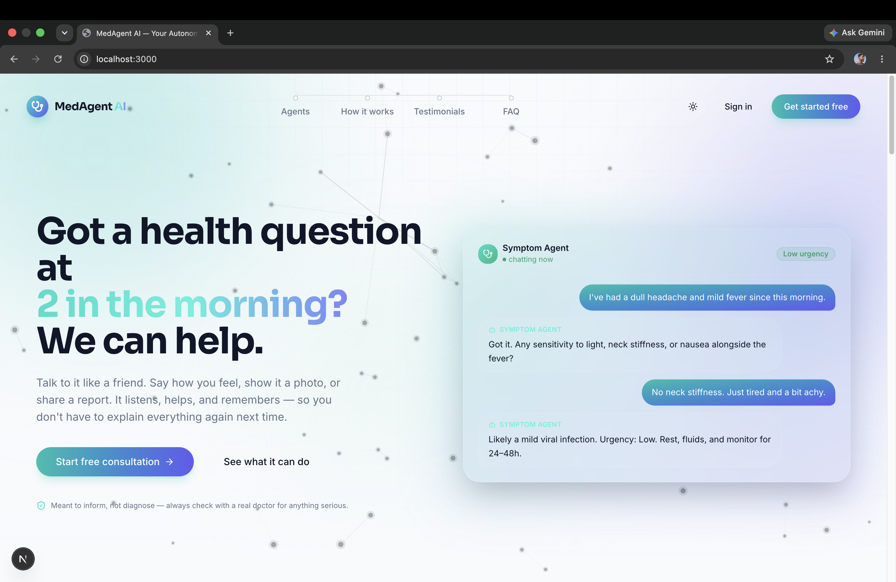

<div align="center">


# MedAgent AI

### Your Autonomous Multi-Agent Healthcare Assistant

Five AI helpers. One simple app for your health questions.

<p>
  <a href="#"></a>
  <a href="#"></a>
  <a href="#"></a>
  <a href="#"></a>
  <a href="./LICENSE"></a>
</p>

<p>
  <a href="https://medagent-ai-nine.vercel.app"></a>
</p>

<p>
  <a href="#-preview">Preview</a> •
  <a href="#-example-conversations">Examples</a> •
  <a href="#-what-can-it-do">Features</a> •
  <a href="#-how-it-stays-reliable">Reliability</a> •
  <a href="#-getting-started">Setup</a> •
  <a href="#-deploying-to-vercel">Deploy</a> •
  <a href="#-license">License</a>
</p>

</div>

<br/>

> ⚠️ **Note:** MedAgent AI gives general health info using AI. It's not a real doctor. For anything serious, talk to a real doctor.

<br/>

## 🖼️ Preview

<div align="center">



<br/>

<sub><b>Modern MedAgent AI Landing Page</b></sub>

</div>
<br/>

## 🌟 What is this?

A smart health assistant you can talk to anytime. Describe symptoms, upload a lab report, photograph a medicine, or just talk out loud — it answers like a careful, caring person would.

It's powered by Gemini AI, with a backup AI ready if Gemini is busy, and a real speaking voice that falls back to your phone's own voice if needed. You never notice the switching — it just works.

<br/>

## 💬 Example conversations

Just talk like you talk to a friend. No hard words needed.

**🗣️ Symptom Checker**
> "My head hurts and I have a little fever since morning."
> "My stomach hurts for two days."

**📄 Lab Report Explainer**
> Upload your report and ask: "What does this mean?"
> "Is anything here bad?"

**💊 Medicine Identifier**
> Take a photo and ask: "What is this medicine for?"
> "Can I take this with paracetamol?"

**🎙️ Voice Chat**
> Press the mic and say: "I have been coughing a lot."

**📊 Health Summary**
> "Tell me about my health this month."
> "Am I getting better?"

If something sounds serious, it tells you clearly and says: go get help now.

<br/>

## ✨ What can it do?

<table>
<tr>
<td width="50%" valign="top">

### 🗣️ Symptom Checker
Describe how you feel. It asks a few questions, then shares what it might be and how urgent it is.

</td>
<td width="50%" valign="top">

### 📄 Report Explainer
Upload a lab report. It reads every value and explains what's normal, in plain words.

</td>
</tr>
<tr>
<td width="50%" valign="top">

### 💊 Medicine Identifier
Photo or name of a medicine → what it's for, how it's taken, and what to watch for.

</td>
<td width="50%" valign="top">

### 🎙️ Voice Chat
Hands-free conversation. It listens, thinks, and replies out loud.

</td>
</tr>
<tr>
<td width="50%" valign="top">

### 📊 Health Summary
One clear summary of your health history, with tips for next steps.

</td>
<td width="50%" valign="top">

### 🎨 Nice to Use
Clean design, smooth animations, dark mode, works on phone and computer.

</td>
</tr>
</table>

<br/>

## 🧠 How it stays reliable

You'll never see this, but here's what keeps it running smoothly:

- 5 different AI keys. If one is busy, it quietly tries the next.
- If all 5 are busy (rare), it switches to a backup AI automatically.
- For voice, 4 different keys. If all fail, it just uses your phone's own voice.
- Every switch is logged for developers — never shown to you.

Simply put: **it's built to keep working, even on a bad day.**

<br/>

## 🧱 Built with

| Part | Tool |
|---|---|
| Website | Next.js + TypeScript |
| Design | Tailwind CSS |
| Login | Clerk |
| Database | Supabase |
| Main AI | Gemini 2.5 Flash (5 keys) |
| Backup AI | OpenRouter |
| Voice | ElevenLabs → browser voice |
| Hosting | Vercel |

<br/>

## 📁 Project layout

<details>
<summary><b>Click to expand</b></summary>

```
medagent-ai/
├── app/
│   ├── api/
│   │   ├── chat/route.ts              # Chat for all agents
│   │   ├── tts/route.ts               # Text to voice
│   │   ├── report-analyze/route.ts    # Reads lab reports
│   │   ├── medicine-scan/route.ts     # Identifies medicines
│   │   └── summary/route.ts           # Health summary
│   ├── dashboard/
│   │   ├── chat/                      # Main chat screen
│   │   ├── reports/                   # Upload reports
│   │   ├── medicine/                  # Medicine scanner
│   │   ├── voice/                     # Voice chat
│   │   ├── summary/                   # Health summary
│   │   ├── profile/
│   │   ├── settings/
│   │   └── layout.tsx
│   ├── sign-in/[[...sign-in]]/
│   ├── sign-up/[[...sign-up]]/
│   ├── layout.tsx
│   ├── page.tsx                       # Homepage
│   └── globals.css
├── components/                        # UI pieces
├── hooks/                             # Reusable app logic
├── lib/
│   ├── gemini.ts                      # AI instructions + key-switching
│   ├── openrouter.ts                  # Backup AI
│   ├── elevenlabs.ts                  # Voice + key-switching
│   ├── ai-router.ts                   # Picks Gemini first, backup if needed
│   ├── supabase.ts
│   ├── utils.ts
│   └── agents.ts
├── utils/
│   ├── retry.ts                       # "Try again" logic
│   └── errors.ts
├── types/
├── middleware.ts                      # Keeps pages private
├── vercel.json
└── .env.example
```

</details>

<br/>

## 🚀 Getting started

### 1 · You'll need

- Node.js 18.18+
- A free [Clerk](https://clerk.com/) account
- A free [Supabase](https://supabase.com/) account
- A [Gemini API key](https://aistudio.google.com/) (free)
- *(Optional)* [OpenRouter](https://openrouter.ai/) key, as backup
- *(Optional)* [ElevenLabs](https://elevenlabs.io/) key, for a nicer voice

### 2 · Download it

```bash
git clone https://github.com/SunnyAgrwl05/medagent-ai.git
cd medagent-ai
npm install
```

### 3 · Add your keys

```bash
cp .env.example .env.local
```

Then open `.env.local` and paste in your keys.

<details>
<summary><b>Click to see what goes inside</b></summary>

```env
# ── Clerk ──────────────────
NEXT_PUBLIC_CLERK_PUBLISHABLE_KEY=pk_test_xxxxx
CLERK_SECRET_KEY=sk_test_xxxxx
NEXT_PUBLIC_CLERK_SIGN_IN_URL=/sign-in
NEXT_PUBLIC_CLERK_SIGN_UP_URL=/sign-up
NEXT_PUBLIC_CLERK_AFTER_SIGN_IN_URL=/dashboard
NEXT_PUBLIC_CLERK_AFTER_SIGN_UP_URL=/dashboard

# ── Supabase ───────────────
NEXT_PUBLIC_SUPABASE_URL=https://xxxxx.supabase.co
NEXT_PUBLIC_SUPABASE_ANON_KEY=xxxxx
SUPABASE_SERVICE_ROLE_KEY=xxxxx

# ── Gemini (add up to 5 keys) ──
GEMINI_API_KEY_1=xxxxx
GEMINI_API_KEY_2=xxxxx
GEMINI_API_KEY_3=xxxxx
GEMINI_API_KEY_4=xxxxx
GEMINI_API_KEY_5=xxxxx

# ── OpenRouter (backup, optional) ──
OPENROUTER_API_KEY=xxxxx
OPENROUTER_MODEL=openai/gpt-4o-mini

# ── ElevenLabs (voice, optional) ──
ELEVENLABS_API_KEY_1=xxxxx
ELEVENLABS_API_KEY_2=xxxxx
ELEVENLABS_API_KEY_3=xxxxx
ELEVENLABS_API_KEY_4=xxxxx
ELEVENLABS_VOICE_ID=xxxxx

# ── App ────────────────────
NEXT_PUBLIC_APP_URL=http://localhost:3000
```

</details>

> 💡 One Gemini key is enough to start. More keys just mean more people can use it at once.

### 4 · Set up the database

Open Supabase's SQL editor and run the setup script at the bottom of `lib/supabase.ts`.

### 5 · Start it

```bash
npm run dev
```

Open **http://localhost:3000** 🎉

### 6 · Build for real use

```bash
npm run build
npm run start
```

<br/>

## ☁️ Deploying to Vercel

1. Push this project to GitHub.
2. Go to [vercel.com/new](https://vercel.com/new) and import it.
3. Vercel detects Next.js automatically.
4. Copy all keys from `.env.example` into Vercel's environment variables.
5. Deploy. Every push to `main` updates it automatically.

```bash
npm install -g vercel
vercel
vercel --prod
```

<br/>

## 🔐 Keeping things safe

- You must be logged in to use the app — your data stays yours.
- All keys stay on the server, never sent to your browser.
- Never share your `.env.local` file — it's already ignored by Git.
- If a key ever leaks, just generate a new one — takes a minute.

<br/>

## 🩺 How the AI is guided

Each agent follows careful instructions — cautious language, no false certainty, always suggesting a real doctor for anything serious. The backup AI follows the same rules, so nothing changes no matter which one answers.

<br/>

## 📦 Quick commands

```bash
npm install       # set up
npm run dev       # run while developing
npm run build     # prepare for real use
npm run start     # run the finished version
npm run lint      # check the code
vercel            # put up a test version
vercel --prod     # go live
```

<br/>

## 📝 License

MIT — see [LICENSE](./LICENSE).

<br/>

<div align="center">

Made with care for people who just want a straight answer about their health.

</div>
